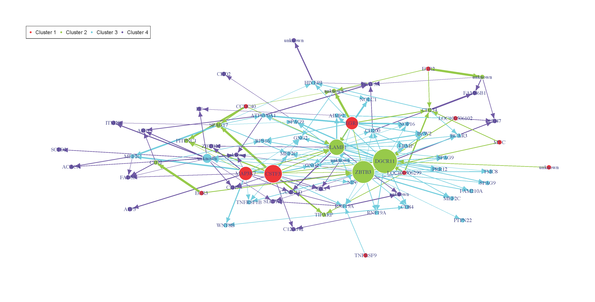
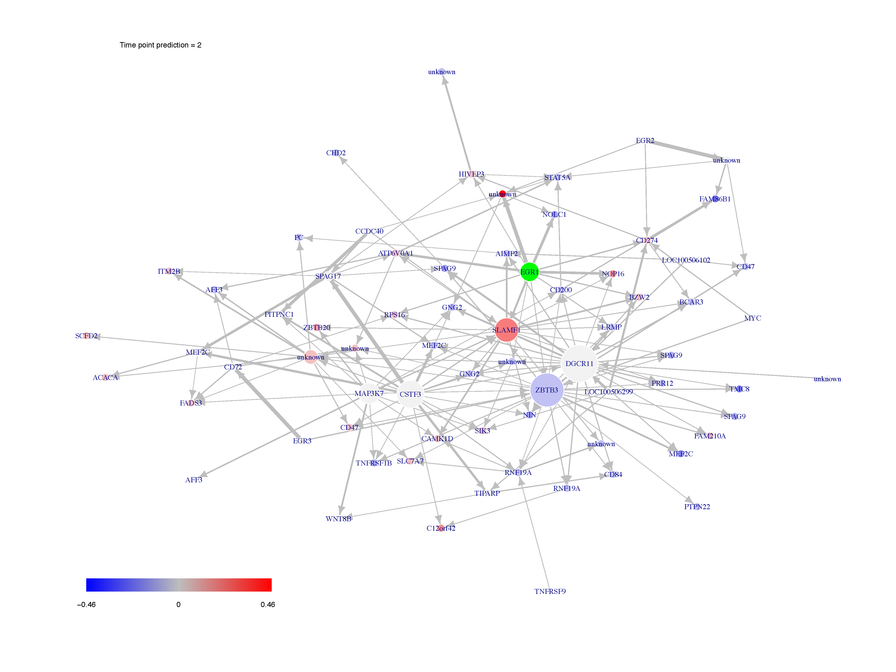

[](https://cran.r-project.org/package=Patterns)

<!-- README.md is generated from README.Rmd. Please edit that file -->

```{r setup, include = FALSE}
knitr::opts_chunk$set(
  collapse = TRUE,
  comment = "#>",
  fig.path = "man/figures/README-",
  out.width = "100%",
  dpi=300,fig.width=7,
  fig.keep="all"
)
```
# Patterns






This website and these examples were created by F. Bertrand and M. Maumy-Bertrand.

## Installation

You can install the released version of Patterns from [CRAN](https://CRAN.R-project.org) with:

```{r, eval = FALSE}
install.packages("Patterns")
```

You can install the development version of Patterns from [github](https://github.com) with:

```{r, eval = FALSE}
devtools::install_github("fbertran/Patterns")
```

## Examples

### Data management
Import Cascade Data (repeated measurements on several subjects) from the CascadeData package and turn them into a micro array object. The second line makes sure the CascadeData package is installed.
```{r microarrayclass, message=FALSE, warning=FALSE}
library(Patterns)
if(!require(CascadeData)){install.packages("CascadeData")}
data(micro_US)
micro_US<-as.micro_array(micro_US[1:100,],time=c(60,90,210,390),subject=6)
str(micro_US)
```

Get a summay and plots of the data:
```{r plotmicroarrayclass, fig.keep='all'}
summary(micro_US)
plot(micro_US)
```

### Gene selection
There are several functions to carry out gene selection before the inference. They are detailed in the vignette of the package. 

### Data simulation
Let's simulate some cascade data and then do some reverse engineering.

We first design the F matrix
```{r createF}
Ti<-4
Ngrp<-4

Fmat=array(0,dim=c(Ti,Ti,Ngrp^2))

for(i in 1:(Ti^2)){
  if(((i-1) %% Ti) > (i-1) %/% Ti){
    Fmat[,,i][outer(1:Ti,1:Ti,function(x,y){0<(x-y) & (x-y)<2})]<-1
    }
}
```

The `Patterns` function `CascadeFinit` is an utility function to easily define such an F matrix.
```{r CascadeInit}
Fbis=Patterns::CascadeFinit(Ti,Ngrp,low.trig=FALSE)
str(Fbis)
```

Check if the two matrices `Fmat` and `Fbis` are identical.
```{r CascadeInitCheck}
print(all(Fmat==Fbis))
```

End of F matrix definition.
```{r CascadeInitCheck}
Fmat[,,3]<-Fmat[,,3]*0.2
Fmat[3,1,3]<-1
Fmat[4,2,3]<-1
Fmat[,,4]<-Fmat[,,3]*0.3
Fmat[4,1,4]<-1
Fmat[,,8]<-Fmat[,,3]
```

We set the seed to make the results reproducible and draw a scale free random network.
```{r randomN}
set.seed(1)
Net<-Patterns::network_random(
  nb=100,
  time_label=rep(1:4,each=25),
  exp=1,
  init=1,
  regul=round(rexp(100,1))+1,
  min_expr=0.1,
  max_expr=2,
  casc.level=0.4
)
Net@F<-Fmat
str(Net)
```

Plot the simulated network.
```{r plotnet}
Patterns::plot(Net, choice="network")
```

If a gene clustering is known, it can be used as a coloring scheme.
```{r plotnet}
plot(Net, choice="network", gr=rep(1:4,each=25))
```

Plot the F matrix, for low dimensional F matrices.
```{r plotF}
plot(Net, choice="F")
```

Plot the F matrix using the `pixmap` package, for high dimensional F matrices.
```{r plotF}
plot(Net, choice="Fpixmap")
```

We simulate gene expression according to the network that was previously drawn
```{r genesimul, message=FALSE, warning=FALSE}
M <- Patterns::gene_expr_simulation(
  network=Net,
  time_label=rep(1:4,each=25),
  subject=5,
  peak_level=200,
  act_time_group=1:4)
str(M)
```

Get a summay and plots of the simulated data:
```{r summarysimuldata}
summary(M)
```

```{r plotsimuldata, fig.keep='all'}
plot(M)
```

### Network inferrence
We infer the new network using subjectwise leave one out cross-validation (default setting): all measurements from the same subject are removed from the dataset). The inference is carried out with a general Fshape.
```{r netinfdefault}
Net_inf_P <- Patterns::inference(M, cv.subjects=TRUE)
```

plot()
plot(Net_inf_P, choice="F")


Heatmap of the coefficients of the Omega matrix of the network
```{r heatresults}
stats::heatmap(Net_inf_P@network, Rowv = NA, Colv = NA, scale="none", revC=TRUE)
```


Default values fot the $F$ matrices. The `Finit` matrix (starting values for the algorithm).
```{r Finitshow}
Finit<-array(0,c(sqF,sqF,nF))	
              for(ii in 1:nF){    
                if((ii%%(ngrp+1))==1){
                  Finit[,,ii]<-0
                } else {
                  Finit[,,ii]<-cbind(rbind(rep(0,sqF-1),diag(1,sqF-1)),rep(0,sqF))+rbind(cbind(rep(0,sqF-1),diag(1,sqF-1)),rep(0,sqF))
                }
              }
```

The `Fshape` matrix (default shape for `F` matrix the algorithm). Any interaction between groups and times are permitted except the retro-actions (a group on itself, or an action at the same time for an actor on another one).
```{r Fshapeshow}
sqF=4;ngrp=4;nF=ngrp^2
Fshape<-array("0",c(sqF,sqF,nF)) 
for(ii in 1:nF){  
  if((ii%%(ngrp+1))==1){
    Fshape[,,ii]<-"0"
  } else {
    lchars <- paste("a",1:(2*sqF-1),sep="")
    tempFshape<-matrix("0",sqF,sqF)
    for(bb in (-sqF+1):(sqF-1)){
      tempFshape<-replaceUp(tempFshape,matrix(lchars[bb+sqF],sqF,sqF),-bb)
    }
    tempFshape <- replaceBand(tempFshape,matrix("0",sqF,sqF),0)
    Fshape[,,ii]<-tempFshape
  }
}
```

Any other form can be used. A "0" coefficient is missing from the model. It allows testing the best structure of an "F" matrix and even performing some significance tests of hypothses on the structure of the $F$ matrix.

The `IndicFshape` function allows to design custom F matrix for cascade networks with equally spaced measurements by specifying the zero and non zero $F_{ij}$ cells of the $F$ matrix. It is useful for models featuring several clusters of actors that are activated at the time. Let's define the following indicatrix matrix (action of all groups on each other, which is not a possible real modeling setting and is only used as an example):
```{r Fshapeothershow}
TestIndic=matrix(!((1:(sqF^2))%%(ngrp+1)==1),byrow=TRUE,ngrp,ngrp)
TestIndic
```

For that choice, we get those init and shape $F$ matrices.
```{r Fshapeothershow2}
IndicFinit(sqF,ngrp,TestIndic)
IndicFshape(sqF,ngrp,TestIndic)
```

Those $F$ matrices are lower diagonal ones to enforce that an observed value at a given time can only be predicted by a value that was observed in the past only (i.e. neither at the same moment or in the future). 

The `plotF` is convenient to display F matrices. Here are the the displays of the three $F$ matrices we have just introduced.

```{r plotfshape1}
plotF(Fshape,choice="Fshape")
```

```{r plotfshape1}
plotF(CascadeFshape(4,4),choice="Fshape")
```
```{r plotfshape1}
plotF(IndicFshape(sqF,ngrp,TestIndic),choice="Fshape")
```

We now fit the model with an $F$ matrix that is designed for cascade networks.

Specific Fshape
```{r netinfdefault}
Net_inf_P_S <- Patterns::inference(M, Finit=CascadeFinit(4,4), Fshape=CascadeFshape(4,4))
```

Heatmap of the coefficients of the Omega matrix of the network. They reflect the use of a special $F$ matrix. It is an example of an F matrix specifically designed to deal with cascade networks.
```{r heatresults}
stats::heatmap(Net_inf_P_S@network, Rowv = NA, Colv = NA, scale="none", revC=TRUE)
```


There are various fitting functions provided with the `Patterns` package:
\describe{
\item{"LASSO", from the `lars` package}
\item{"LASSO2", from the `glmnet` package}
\item{"SPLS", from the `spls` package}
\item{"ELASTICNET", from the `elasticnet` package}
\item{"stability.c060", from the `c060` package implementation of stability selection}
\item{"stability.c060.weighted", a new weighted version of the `c060` package implementation of stability selection}
\item{"robust", lasso from the `lars` package with light random Gaussian noise added to the explanatory variables}
\item{"selectboost.weighted", a new weighted version of the `selectboost` package implementation of the selectboost algorithm to look for the more stable links against resampling that takes into account the correlated structure of the predictors. If no weights are provided, equal weigths are for all the variables (=non weighted case).}
}

```{r netinflasso2}
Net_inf_P_Lasso2 <- Patterns::inference(M, Finit=CascadeFinit(4,4), Fshape=CascadeFshape(4,4), fitfun="LASSO2")
```

```{r netinf}
Net_inf_P_SPLS <- Patterns::inference(M, Finit=CascadeFinit(4,4), Fshape=CascadeFshape(4,4), fitfun="SPLS")
```

```{r netinf}
Net_inf_P_ELASTICNET <- Patterns::inference(M, Finit=CascadeFinit(4,4), Fshape=CascadeFshape(4,4), fitfun="ELASTICNET")
```

Heatmap of the coefficients of the Omega matrix of the network
```{r heatresults}
stats::heatmap(Net_inf_P_ELASTICNET@network, Rowv = NA, Colv = NA, scale="none", revC=TRUE)
```

```{r netinf}
Net_inf_P_stability <- Patterns::inference(M, Finit=CascadeFinit(4,4), Fshape=CascadeFshape(4,4), fitfun="stability.c060")
```

Heatmap of the coefficients of the Omega matrix of the network
```{r heatresults}
stats::heatmap(Net_inf_P_stability@network, Rowv = NA, Colv = NA, scale="none", revC=TRUE)
```

```{r netinf}
Net_inf_P_ELASTICNET <- Patterns::inference(M, Finit=CascadeFinit(4,4), Fshape=CascadeFshape(4,4), fitfun="stability.c060.weighted")
```

```{r netinf}
Net_inf_P_ELASTICNET <- Patterns::inference(M, Finit=CascadeFinit(4,4), Fshape=CascadeFshape(4,4), fitfun="robust")
```

```{r netinf}
Net_inf_P_ELASTICNET <- Patterns::inference(M, Finit=CascadeFinit(4,4), Fshape=CascadeFshape(4,4), fitfun="selectboost.weighted")
```

###Post inference network analysis
Such an analysis is only required if the model was not fitted using the stability selection or the selectboost algorithm.


We switch to data that were derived from the inferrence of a real biological network and try to detect the optimal cutoff value: the best cutoff value for a network to fit a scale free network. The `cutoff` was validated only single group cascade networks (number of actors groups = number of timepoints) and for genes dataset. Instead of the `cutoff` function, manual curation or the stability selection or the selectboost algorithm should be used.

```{r cutoff, cache=TRUE}
data("networkCascade")
set.seed(1)
cutoff(networkCascade)
```

Analyze the network with a cutoff set to the previouly found 0.133 optimal value.

```{r analyzenet, warning=FALSE}
analyze_network(networkCascade,nv=0.133)
```

```{r plotnet, warning=FALSE}
data(Selection)
plot(networkCascade,nv=0.133, gr=Selection@group)
```

### Perform gene selection

Import data.
```{r microselection, warning=FALSE}
library(Patterns)
library(CascadeData)
data(micro_S)
micro_S<-as.micro_array(micro_S,time=c(60,90,210,390),subject=6,gene_ID=rownames(micro_S))
```

Select early genes (t1 or t2):
```{r microselection1, warning=FALSE}
Selection1<-geneSelection(x=micro_S,y=micro_US,20,
wanted.patterns=
rbind(c(0,1,0,0),c(1,0,0,0),c(1,1,0,0)))
```

Section genes with first significant differential  expression at t1:
```{r microselection2, warning=FALSE}
Selection2<-geneSelection(x=micro_S,y=micro_US,20,
peak=1)
```

Section genes with first significant differential expression at t2:
```{r microselection3, warning=FALSE}
Selection3<-geneSelection(x=micro_S,y=micro_US,20,peak=2)
```

Select later genes (t3 or t4)
```{r microselection4, warning=FALSE}
Selection4<-geneSelection(x=micro_S,y=micro_US,50,
wanted.patterns=rbind(c(0,0,1,0),c(0,0,0,1),c(1,1,0,0)))
```

Merge those selections:
```{r microselection5, warning=FALSE}
Selection<-unionMicro(Selection1,Selection2)
Selection<-unionMicro(Selection,Selection3)
Selection<-unionMicro(Selection,Selection4)
head(Selection)
```

Summarize the final selection:
```{r microselection6, warning=FALSE}
summary(Selection)
```

Plot the final selection:
```{r microselection7, warning=FALSE}
plot(Selection)
```

This process could be improved by retrieve a real gene_ID using the `bitr` function of the `ClusterProfiler` package or by performing independent filtering using `jetset` package to only keep at most only probeset (the best one, if there is one good enough) per gene_ID.
