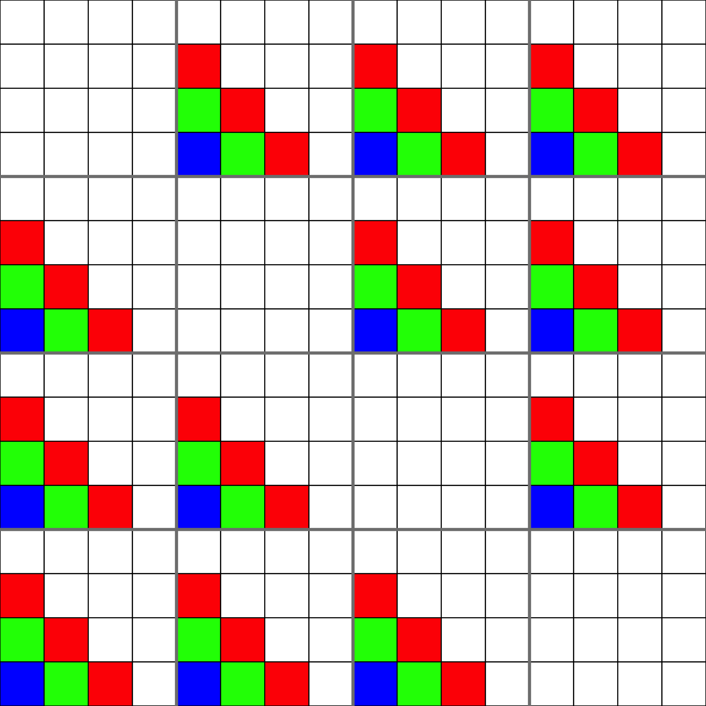
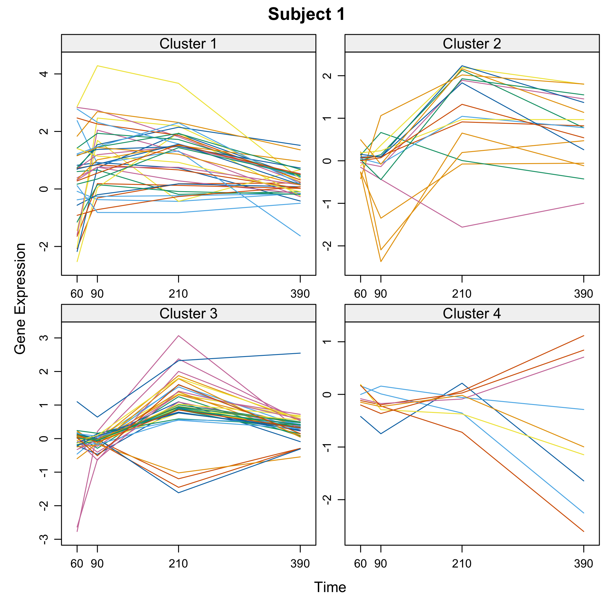
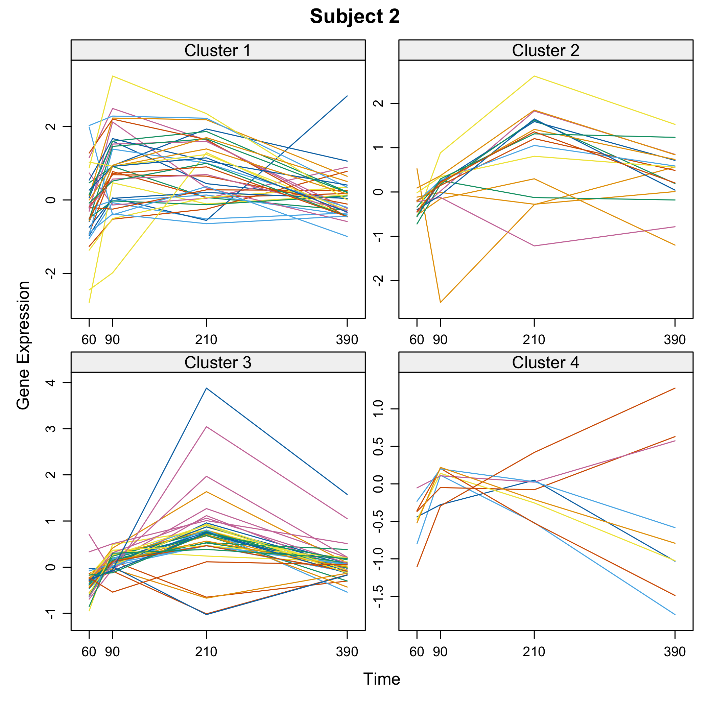

<!-- README.md is generated from README.Rmd. Please edit that file -->


# Patterns 

# A modeling tool dedicated to biological network modeling to decipher Biological Networks with Patterned Heterogeneous (e.g. multiOmics) Measurements
## Frédéric Bertrand and Myriam Maumy-Bertrand

<!-- badges: start -->
[](https://lifecycle.r-lib.org/articles/stages.html)
[](https://www.repostatus.org/#active)
[](https://github.com/fbertran/Patterns/actions)
[](https://app.codecov.io/gh/fbertran/Patterns?branch=master)
[](https://cran.r-project.org/package=Patterns)
[](https://cran.r-project.org/package=Patterns)
[](https://github.com/fbertran/Patterns)
[](https://zenodo.org/badge/latestdoi/18441799)
<!-- badges: end -->


It is designed to work with **patterned data**. Famous examples of problems related to patterned data are:

* recovering **signals** in networks after a **stimulation** (cascade network reverse engineering),
* analysing **periodic signals**.

It allows for **single** or **joint modeling** of, for instance, genes and proteins. 

* It starts with the **selection of the actors** that will be the used in the reverse engineering upcoming step. An actor can be included in that selection based on its **differential effects** (for instance gene expression or protein abundance) or on its **time course profile**. 
* Wrappers for **actors clustering** functions and cluster analysis are provided. 
* It also allows **reverse engineering** of biological networks taking into account the observed time course patterns of the actors. Interactions between clusters of actors can be set by the user. Any number of clusters can be activated at a single time.
* Many **inference functions** are provided with the `Patterns` package and dedicated to get **specific features** for the inferred network such as **sparsity**, **robust links**, **high confidence links** or **stable through resampling links**. 
    + **lasso**, from the `lars` package
    + **lasso**, from the `glmnet` package. An unweighted and a weighted version of the algorithm are available
    + **spls**, from the `spls` package
    + **elasticnet**, from the `elasticnet` package
    + **stability selection**, from the `c060` package implementation of stability selection
    + **weighted stability selection**, a new weighted version of the `c060` package implementation of stability selection that I created for the package
    + **robust**, lasso from the `lars` package with light random Gaussian noise added to the explanatory variables
    + **selectboost**, from the `selectboost` package. The selectboost algorithm looks for the more stable links against resampling that takes into account the correlated structure of the predictors
    + **weighted selectboost**, a new weighted version of the `selectboost`.
* Some **simulation** and **prediction** tools are also available for cascade networks. 
* Examples of use with microarray or RNA-Seq data are provided.


The weights are viewed as a penalty factors in the penalized regression model: it is a number that multiplies the lambda value in the minimization problem to allow differential shrinkage, [Friedman et al. 2010](https://github.com/fbertran/Patterns/raw/master/add_data/glmnet.pdf), equation 1 page 3. If equal to 0, it implies no shrinkage, and that variable is always included in the model. Default is 1 for all variables. Infinity means that the variable is excluded from the model. Note that the weights are rescaled to sum to the number of variables.


A word for those that have been using our seminal work, the `Cascade` package that we created several years ago and that was a very efficient network reverse engineering tool for cascade networks 
(Jung, N., Bertrand, F., Bahram, S., Vallat, L., and Maumy-Bertrand, M. (2014), <https://doi.org/10.1093/bioinformatics/btt705>, <https://cran.r-project.org/package=Cascade>, <https://github.com/fbertran/Cascade> and <https://fbertran.github.io/Cascade/>).


The `Patterns` package is more than (at least) a threeway major extension of the `Cascade` package :

* **any number of groups** can be used whereas in the `Cascade` package only 1 group for each timepoint could be created, which prevented the users to create homogeneous clusters of genes in datasets that featured more than a few dozens of genes.
* **custom** $F$ matrices shapes whereas in the `Cascade` package only 1 shape was provided:
    + interaction between groups
    + custom design of inner cells of the $F$ matrix
* the custom $F$ matrices allow to deal with **heteregeneous networks** with several kinds of actors such as mixing genes and proteins in a single network to perform **joint inference**.
* about **nine inference algorithms** are provided, whereas 1 (lasso) in `Cascade`.

Hence the `Patterns` package should be viewed more as a completely new modelling tools than as an extension of the `Cascade` package.


This website and these examples were created by F. Bertrand and M. Maumy-Bertrand.

## Installation

You can install the released version of Patterns from [CRAN](https://CRAN.R-project.org) with:


```r
install.packages("Patterns")
```

You can install the development version of Patterns from [github](https://github.com) with:


```r
devtools::install_github("fbertran/Patterns")
```

## Examples

### Data management
Import Cascade Data (repeated measurements on several subjects) from the CascadeData package and turn them into a omics array object. The second line makes sure the CascadeData package is installed.

```r
library(Patterns)
```

```r
if(!require(CascadeData)){install.packages("CascadeData")}
data(micro_US)
micro_US<-as.omics_array(micro_US[1:100,],time=c(60,90,210,390),subject=6)
str(micro_US)
#> Formal class 'omics_array' [package "Patterns"] with 7 slots
#>   ..@ omicsarray: num [1:100, 1:24] 103.2 26 70.7 213.7 13.7 ...
#>   .. ..- attr(*, "dimnames")=List of 2
#>   .. .. ..$ : chr [1:100] "1007_s_at" "1053_at" "117_at" "121_at" ...
#>   .. .. ..$ : chr [1:24] "N1_US_T60" "N1_US_T90" "N1_US_T210" "N1_US_T390" ...
#>   ..@ name      : chr [1:100] "1007_s_at" "1053_at" "117_at" "121_at" ...
#>   ..@ gene_ID   : num 0
#>   ..@ group     : num 0
#>   ..@ start_time: num 0
#>   ..@ time      : num [1:4] 60 90 210 390
#>   ..@ subject   : num 6
```

Get a summay and plots of the data:

```r
summary(micro_US)
#>    N1_US_T60        N1_US_T90        N1_US_T210       N1_US_T390    
#>  Min.   :  12.2   Min.   :  12.9   Min.   :   1.5   Min.   :  10.1  
#>  1st Qu.: 177.7   1st Qu.: 198.7   1st Qu.: 189.0   1st Qu.: 196.7  
#>  Median : 513.0   Median : 499.4   Median : 608.5   Median : 541.2  
#>  Mean   :1386.6   Mean   :1357.7   Mean   :1450.4   Mean   :1331.2  
#>  3rd Qu.:1912.3   3rd Qu.:1883.4   3rd Qu.:2050.2   3rd Qu.:1646.2  
#>  Max.   :6348.4   Max.   :6507.3   Max.   :6438.5   Max.   :6351.4  
#>    N2_US_T60        N2_US_T90        N2_US_T210       N2_US_T390    
#>  Min.   :  16.7   Min.   :   3.4   Min.   :   5.5   Min.   :   6.1  
#>  1st Qu.: 212.4   1st Qu.: 185.7   1st Qu.: 214.7   1st Qu.: 230.1  
#>  Median : 584.1   Median : 501.5   Median : 596.0   Median : 601.8  
#>  Mean   :1381.9   Mean   :1345.4   Mean   :1410.5   Mean   :1403.7  
#>  3rd Qu.:1616.2   3rd Qu.:1830.5   3rd Qu.:2005.8   3rd Qu.:1901.7  
#>  Max.   :6149.3   Max.   :6090.8   Max.   :6160.6   Max.   :6143.1  
#>    N3_US_T60        N3_US_T90        N3_US_T210       N3_US_T390    
#>  Min.   :   1.9   Min.   :  10.3   Min.   :   3.3   Min.   :   6.6  
#>  1st Qu.: 187.4   1st Qu.: 194.6   1st Qu.: 177.8   1st Qu.: 222.6  
#>  Median : 611.4   Median : 576.2   Median : 552.2   Median : 593.7  
#>  Mean   :1365.4   Mean   :1381.2   Mean   :1310.1   Mean   :1427.1  
#>  3rd Qu.:1855.2   3rd Qu.:2040.2   3rd Qu.:1784.5   3rd Qu.:2131.7  
#>  Max.   :6636.6   Max.   :6515.5   Max.   :6530.4   Max.   :6177.2  
#>    N4_US_T60        N4_US_T90        N4_US_T210       N4_US_T390    
#>  Min.   :  20.2   Min.   :  15.6   Min.   :  19.8   Min.   :   9.3  
#>  1st Qu.: 199.3   1st Qu.: 215.4   1st Qu.: 207.0   1st Qu.: 197.8  
#>  Median : 610.8   Median : 614.0   Median : 544.9   Median : 590.7  
#>  Mean   :1505.1   Mean   :1526.7   Mean   :1401.6   Mean   :1458.8  
#>  3rd Qu.:2198.1   3rd Qu.:2168.9   3rd Qu.:1831.2   3rd Qu.:1984.8  
#>  Max.   :6986.2   Max.   :7148.0   Max.   :6820.0   Max.   :6762.3  
#>    N5_US_T60        N5_US_T90        N5_US_T210       N5_US_T390    
#>  Min.   :   3.4   Min.   :  10.0   Min.   :  10.7   Min.   :  16.5  
#>  1st Qu.: 213.2   1st Qu.: 209.8   1st Qu.: 202.0   1st Qu.: 208.2  
#>  Median : 609.4   Median : 561.3   Median : 555.6   Median : 570.5  
#>  Mean   :1498.2   Mean   :1424.8   Mean   :1394.1   Mean   :1435.3  
#>  3rd Qu.:2008.7   3rd Qu.:1906.5   3rd Qu.:1923.9   3rd Qu.:1867.8  
#>  Max.   :7268.2   Max.   :6857.8   Max.   :6574.0   Max.   :6896.6  
#>    N6_US_T60        N6_US_T90        N6_US_T210       N6_US_T390    
#>  Min.   :  13.0   Min.   :   6.6   Min.   :   3.8   Min.   :  14.4  
#>  1st Qu.: 207.5   1st Qu.: 198.6   1st Qu.: 203.9   1st Qu.: 195.8  
#>  Median : 516.2   Median : 530.6   Median : 578.0   Median : 580.0  
#>  Mean   :1412.9   Mean   :1388.3   Mean   :1416.5   Mean   :1360.8  
#>  3rd Qu.:2037.4   3rd Qu.:1889.8   3rd Qu.:2030.8   3rd Qu.:1872.6  
#>  Max.   :6898.1   Max.   :6749.4   Max.   :6490.0   Max.   :6780.2
```


```r
plot(micro_US)
```


### Gene selection
There are several functions to carry out gene selection before the inference. They are detailed in the vignette of the package. 

### Data simulation
Let's simulate some cascade data and then do some reverse engineering.

We first design the F matrix for $T_i=4$ times and $Ngrp=4$ groups. The `Fmat`object is an array of sizes $(T_i,T-i,Ngrp^2)=(4,4,16)$.

```r
Ti<-4
Ngrp<-4

Fmat=array(0,dim=c(Ti,Ti,Ngrp^2))

for(i in 1:(Ti^2)){
  if(((i-1) %% Ti) > (i-1) %/% Ti){
    Fmat[,,i][outer(1:Ti,1:Ti,function(x,y){0<(x-y) & (x-y)<2})]<-1
    }
}
```

The `Patterns` function `CascadeFinit` is an utility function to easily define such an F matrix.

```r
Fbis=Patterns::CascadeFinit(Ti,Ngrp,low.trig=FALSE)
str(Fbis)
#>  num [1:4, 1:4, 1:16] 0 0 0 0 0 0 0 0 0 0 ...
```

Check if the two matrices `Fmat` and `Fbis` are identical.

```r
print(all(Fmat==Fbis))
#> [1] TRUE
```

End of F matrix definition.

```r
Fmat[,,3]<-Fmat[,,3]*0.2
Fmat[3,1,3]<-1
Fmat[4,2,3]<-1
Fmat[,,4]<-Fmat[,,3]*0.3
Fmat[4,1,4]<-1
Fmat[,,8]<-Fmat[,,3]
```

We set the seed to make the results reproducible and draw a scale free random network.

```r
set.seed(1)
Net<-Patterns::network_random(
  nb=100,
  time_label=rep(1:4,each=25),
  exp=1,
  init=1,
  regul=round(rexp(100,1))+1,
  min_expr=0.1,
  max_expr=2,
  casc.level=0.4
)
Net@F<-Fmat
str(Net)
#> Formal class 'omics_network' [package "Patterns"] with 6 slots
#>   ..@ omics_network: num [1:100, 1:100] 0 0 0 0 0 0 0 0 0 0 ...
#>   ..@ name         : chr [1:100] "gene 1" "gene 2" "gene 3" "gene 4" ...
#>   ..@ F            : num [1:4, 1:4, 1:16] 0 0 0 0 0 0 0 0 0 0 ...
#>   ..@ convF        : num [1, 1] 0
#>   ..@ convO        : num 0
#>   ..@ time_pt      : int [1:4] 1 2 3 4
```

Plot the simulated network.

```r
Patterns::plot(Net, choice="network")
```

If a gene clustering is known, it can be used as a coloring scheme.

```r
plot(Net, choice="network", gr=rep(1:4,each=25))
```

Plot the F matrix, for low dimensional F matrices.

```r
plot(Net, choice="F")
```

<div class="figure">

<p class="caption">plot of chunk plotF</p>
</div>

Plot the F matrix using the `pixmap` package, for high dimensional F matrices.

```r
plot(Net, choice="Fpixmap")
```

<div class="figure">

<p class="caption">plot of chunk plotFpixmap</p>
</div>

We simulate gene expression according to the network that was previously drawn

```r
set.seed(1)
M <- Patterns::gene_expr_simulation(
  network=Net,
  time_label=rep(1:4,each=25),
  subject=5,
  peak_level=200,
  act_time_group=1:4)
#> Error: unable to find an inherited method for function 'gene_expr_simulation' for signature 'omics_network = "missing"'
str(M)
#> Error in eval(expr, envir, enclos): object 'M' not found
```

Get a summay and plots of the simulated data:

```r
summary(M)
#> Error in h(simpleError(msg, call)): erreur d'�valuation de l'argument 'object' lors de la s�lection d'une m�thode pour la fonction 'summary' : objet 'M' introuvable
```


```r
plot(M)
#> Error in h(simpleError(msg, call)): erreur d'�valuation de l'argument 'x' lors de la s�lection d'une m�thode pour la fonction 'plot' : objet 'M' introuvable
```

### Network inferrence
We infer the new network using subjectwise leave one out cross-validation (default setting): all measurements from the same subject are removed from the dataset). The inference is carried out with a general Fshape.

```r
Net_inf_P <- Patterns::inference(M, cv.subjects=TRUE)
#> Error in h(simpleError(msg, call)): erreur d'�valuation de l'argument 'M' lors de la s�lection d'une m�thode pour la fonction 'inference' : objet 'M' introuvable
```

Plot of the inferred F matrix

```r
plot(Net_inf_P, choice="F")
#> Error in h(simpleError(msg, call)): error in evaluating the argument 'x' in selecting a method for function 'plot': object 'Net_inf_P' not found
```

Heatmap of the inferred coefficients of the Omega matrix

```r
stats::heatmap(Net_inf_P@network, Rowv = NA, Colv = NA, scale="none", revC=TRUE)
#> Error in eval(expr, envir, enclos): object 'Net_inf_P' not found
```


Default values fot the $F$ matrices. The `Finit` matrix (starting values for the algorithm). In our case, the `Finit`object is an array of sizes $(T_i,T-i,Ngrp^2)=(4,4,16)$.

```r
Ti<-4;
ngrp<-4
nF<-ngrp^2
Finit<-array(0,c(Ti,Ti,nF))	
              for(ii in 1:nF){    
                if((ii%%(ngrp+1))==1){
                  Finit[,,ii]<-0
                } else {
                  Finit[,,ii]<-cbind(rbind(rep(0,Ti-1),diag(1,Ti-1)),rep(0,Ti))+rbind(cbind(rep(0,Ti-1),diag(1,Ti-1)),rep(0,Ti))
                }
              }
```

The `Fshape` matrix (default shape for `F` matrix the algorithm). Any interaction between groups and times are permitted except the retro-actions (a group on itself, or an action at the same time for an actor on another one).

```r
Fshape<-array("0",c(Ti,Ti,nF)) 
for(ii in 1:nF){  
  if((ii%%(ngrp+1))==1){
    Fshape[,,ii]<-"0"
  } else {
    lchars <- paste("a",1:(2*Ti-1),sep="")
    tempFshape<-matrix("0",Ti,Ti)
    for(bb in (-Ti+1):(Ti-1)){
      tempFshape<-replaceUp(tempFshape,matrix(lchars[bb+Ti],Ti,Ti),-bb)
    }
    tempFshape <- replaceBand(tempFshape,matrix("0",Ti,Ti),0)
    Fshape[,,ii]<-tempFshape
  }
}
```

Any other form can be used. A "0" coefficient is missing from the model. It allows testing the best structure of an "F" matrix and even performing some significance tests of hypothses on the structure of the $F$ matrix.

The `IndicFshape` function allows to design custom F matrix for cascade networks with equally spaced measurements by specifying the zero and non zero $F_{ij}$ cells of the $F$ matrix. It is useful for models featuring several clusters of actors that are activated at the time. Let's define the following indicatrix matrix (action of all groups on each other, which is not a possible real modeling setting and is only used as an example):

```r
TestIndic=matrix(!((1:(Ti^2))%%(ngrp+1)==1),byrow=TRUE,ngrp,ngrp)
TestIndic
#>       [,1]  [,2]  [,3]  [,4]
#> [1,] FALSE  TRUE  TRUE  TRUE
#> [2,]  TRUE FALSE  TRUE  TRUE
#> [3,]  TRUE  TRUE FALSE  TRUE
#> [4,]  TRUE  TRUE  TRUE FALSE
```

For that choice, we get those init and shape $F$ matrices.

```r
IndicFinit(Ti,ngrp,TestIndic)
#> , , 1
#> 
#>      [,1] [,2] [,3] [,4]
#> [1,]    0    0    0    0
#> [2,]    0    0    0    0
#> [3,]    0    0    0    0
#> [4,]    0    0    0    0
#> 
#> , , 2
#> 
#>      [,1] [,2] [,3] [,4]
#> [1,]    0    0    0    0
#> [2,]    1    0    0    0
#> [3,]    1    1    0    0
#> [4,]    1    1    1    0
#> 
#> , , 3
#> 
#>      [,1] [,2] [,3] [,4]
#> [1,]    0    0    0    0
#> [2,]    1    0    0    0
#> [3,]    1    1    0    0
#> [4,]    1    1    1    0
#> 
#> , , 4
#> 
#>      [,1] [,2] [,3] [,4]
#> [1,]    0    0    0    0
#> [2,]    1    0    0    0
#> [3,]    1    1    0    0
#> [4,]    1    1    1    0
#> 
#> , , 5
#> 
#>      [,1] [,2] [,3] [,4]
#> [1,]    0    0    0    0
#> [2,]    1    0    0    0
#> [3,]    1    1    0    0
#> [4,]    1    1    1    0
#> 
#> , , 6
#> 
#>      [,1] [,2] [,3] [,4]
#> [1,]    0    0    0    0
#> [2,]    0    0    0    0
#> [3,]    0    0    0    0
#> [4,]    0    0    0    0
#> 
#> , , 7
#> 
#>      [,1] [,2] [,3] [,4]
#> [1,]    0    0    0    0
#> [2,]    1    0    0    0
#> [3,]    1    1    0    0
#> [4,]    1    1    1    0
#> 
#> , , 8
#> 
#>      [,1] [,2] [,3] [,4]
#> [1,]    0    0    0    0
#> [2,]    1    0    0    0
#> [3,]    1    1    0    0
#> [4,]    1    1    1    0
#> 
#> , , 9
#> 
#>      [,1] [,2] [,3] [,4]
#> [1,]    0    0    0    0
#> [2,]    1    0    0    0
#> [3,]    1    1    0    0
#> [4,]    1    1    1    0
#> 
#> , , 10
#> 
#>      [,1] [,2] [,3] [,4]
#> [1,]    0    0    0    0
#> [2,]    1    0    0    0
#> [3,]    1    1    0    0
#> [4,]    1    1    1    0
#> 
#> , , 11
#> 
#>      [,1] [,2] [,3] [,4]
#> [1,]    0    0    0    0
#> [2,]    0    0    0    0
#> [3,]    0    0    0    0
#> [4,]    0    0    0    0
#> 
#> , , 12
#> 
#>      [,1] [,2] [,3] [,4]
#> [1,]    0    0    0    0
#> [2,]    1    0    0    0
#> [3,]    1    1    0    0
#> [4,]    1    1    1    0
#> 
#> , , 13
#> 
#>      [,1] [,2] [,3] [,4]
#> [1,]    0    0    0    0
#> [2,]    1    0    0    0
#> [3,]    1    1    0    0
#> [4,]    1    1    1    0
#> 
#> , , 14
#> 
#>      [,1] [,2] [,3] [,4]
#> [1,]    0    0    0    0
#> [2,]    1    0    0    0
#> [3,]    1    1    0    0
#> [4,]    1    1    1    0
#> 
#> , , 15
#> 
#>      [,1] [,2] [,3] [,4]
#> [1,]    0    0    0    0
#> [2,]    1    0    0    0
#> [3,]    1    1    0    0
#> [4,]    1    1    1    0
#> 
#> , , 16
#> 
#>      [,1] [,2] [,3] [,4]
#> [1,]    0    0    0    0
#> [2,]    0    0    0    0
#> [3,]    0    0    0    0
#> [4,]    0    0    0    0
IndicFshape(Ti,ngrp,TestIndic)
#> , , 1
#> 
#>      [,1] [,2] [,3] [,4]
#> [1,] "0"  "0"  "0"  "0" 
#> [2,] "0"  "0"  "0"  "0" 
#> [3,] "0"  "0"  "0"  "0" 
#> [4,] "0"  "0"  "0"  "0" 
#> 
#> , , 2
#> 
#>      [,1] [,2] [,3] [,4]
#> [1,] "0"  "0"  "0"  "0" 
#> [2,] "a1" "0"  "0"  "0" 
#> [3,] "a2" "a1" "0"  "0" 
#> [4,] "a3" "a2" "a1" "0" 
#> 
#> , , 3
#> 
#>      [,1] [,2] [,3] [,4]
#> [1,] "0"  "0"  "0"  "0" 
#> [2,] "a1" "0"  "0"  "0" 
#> [3,] "a2" "a1" "0"  "0" 
#> [4,] "a3" "a2" "a1" "0" 
#> 
#> , , 4
#> 
#>      [,1] [,2] [,3] [,4]
#> [1,] "0"  "0"  "0"  "0" 
#> [2,] "a1" "0"  "0"  "0" 
#> [3,] "a2" "a1" "0"  "0" 
#> [4,] "a3" "a2" "a1" "0" 
#> 
#> , , 5
#> 
#>      [,1] [,2] [,3] [,4]
#> [1,] "0"  "0"  "0"  "0" 
#> [2,] "a1" "0"  "0"  "0" 
#> [3,] "a2" "a1" "0"  "0" 
#> [4,] "a3" "a2" "a1" "0" 
#> 
#> , , 6
#> 
#>      [,1] [,2] [,3] [,4]
#> [1,] "0"  "0"  "0"  "0" 
#> [2,] "0"  "0"  "0"  "0" 
#> [3,] "0"  "0"  "0"  "0" 
#> [4,] "0"  "0"  "0"  "0" 
#> 
#> , , 7
#> 
#>      [,1] [,2] [,3] [,4]
#> [1,] "0"  "0"  "0"  "0" 
#> [2,] "a1" "0"  "0"  "0" 
#> [3,] "a2" "a1" "0"  "0" 
#> [4,] "a3" "a2" "a1" "0" 
#> 
#> , , 8
#> 
#>      [,1] [,2] [,3] [,4]
#> [1,] "0"  "0"  "0"  "0" 
#> [2,] "a1" "0"  "0"  "0" 
#> [3,] "a2" "a1" "0"  "0" 
#> [4,] "a3" "a2" "a1" "0" 
#> 
#> , , 9
#> 
#>      [,1] [,2] [,3] [,4]
#> [1,] "0"  "0"  "0"  "0" 
#> [2,] "a1" "0"  "0"  "0" 
#> [3,] "a2" "a1" "0"  "0" 
#> [4,] "a3" "a2" "a1" "0" 
#> 
#> , , 10
#> 
#>      [,1] [,2] [,3] [,4]
#> [1,] "0"  "0"  "0"  "0" 
#> [2,] "a1" "0"  "0"  "0" 
#> [3,] "a2" "a1" "0"  "0" 
#> [4,] "a3" "a2" "a1" "0" 
#> 
#> , , 11
#> 
#>      [,1] [,2] [,3] [,4]
#> [1,] "0"  "0"  "0"  "0" 
#> [2,] "0"  "0"  "0"  "0" 
#> [3,] "0"  "0"  "0"  "0" 
#> [4,] "0"  "0"  "0"  "0" 
#> 
#> , , 12
#> 
#>      [,1] [,2] [,3] [,4]
#> [1,] "0"  "0"  "0"  "0" 
#> [2,] "a1" "0"  "0"  "0" 
#> [3,] "a2" "a1" "0"  "0" 
#> [4,] "a3" "a2" "a1" "0" 
#> 
#> , , 13
#> 
#>      [,1] [,2] [,3] [,4]
#> [1,] "0"  "0"  "0"  "0" 
#> [2,] "a1" "0"  "0"  "0" 
#> [3,] "a2" "a1" "0"  "0" 
#> [4,] "a3" "a2" "a1" "0" 
#> 
#> , , 14
#> 
#>      [,1] [,2] [,3] [,4]
#> [1,] "0"  "0"  "0"  "0" 
#> [2,] "a1" "0"  "0"  "0" 
#> [3,] "a2" "a1" "0"  "0" 
#> [4,] "a3" "a2" "a1" "0" 
#> 
#> , , 15
#> 
#>      [,1] [,2] [,3] [,4]
#> [1,] "0"  "0"  "0"  "0" 
#> [2,] "a1" "0"  "0"  "0" 
#> [3,] "a2" "a1" "0"  "0" 
#> [4,] "a3" "a2" "a1" "0" 
#> 
#> , , 16
#> 
#>      [,1] [,2] [,3] [,4]
#> [1,] "0"  "0"  "0"  "0" 
#> [2,] "0"  "0"  "0"  "0" 
#> [3,] "0"  "0"  "0"  "0" 
#> [4,] "0"  "0"  "0"  "0"
```

Those $F$ matrices are lower diagonal ones to enforce that an observed value at a given time can only be predicted by a value that was observed in the past only (i.e. neither at the same moment or in the future). 

The `plotF` is convenient to display F matrices. Here are the the displays of the three $F$ matrices we have just introduced.


```r
plotF(Fshape,choice="Fshape")
```

<div class="figure">

<p class="caption">plot of chunk plotfshape1</p>
</div>


```r
plotF(CascadeFshape(4,4),choice="Fshape")
```

<div class="figure">

<p class="caption">plot of chunk plotfshape2</p>
</div>

```r
plotF(IndicFshape(Ti,ngrp,TestIndic),choice="Fshape")
```

<div class="figure">

<p class="caption">plot of chunk plotfshape3</p>
</div>

We now fit the model with an $F$ matrix that is designed for cascade networks.

Specific Fshape

```r
Net_inf_P_S <- Patterns::inference(M, Finit=CascadeFinit(4,4), Fshape=CascadeFshape(4,4))
#> Error in h(simpleError(msg, call)): erreur d'�valuation de l'argument 'M' lors de la s�lection d'une m�thode pour la fonction 'inference' : objet 'M' introuvable
```

Plot of the inferred F matrix

```r
plot(Net_inf_P_S, choice="F")
#> Error in h(simpleError(msg, call)): error in evaluating the argument 'x' in selecting a method for function 'plot': object 'Net_inf_P_S' not found
```

Heatmap of the coefficients of the Omega matrix of the network. They reflect the use of a special $F$ matrix. It is an example of an F matrix specifically designed to deal with cascade networks.

```r
stats::heatmap(Net_inf_P_S@network, Rowv = NA, Colv = NA, scale="none", revC=TRUE)
#> Error in eval(expr, envir, enclos): object 'Net_inf_P_S' not found
```


There are many fitting functions provided with the `Patterns` package in order to search for **specific features** for the inferred network such as **sparsity**, **robust links**, **high confidence links** or **stable through resampling links**. :

* **LASSO**, from the `lars` package
* **LASSO2**, from the `glmnet` package. An unweighted and a weighted version of the algorithm are available
* **SPLS**, from the `spls` package
* **ELASTICNET**, from the `elasticnet` package
* **stability.c060**, from the `c060` package implementation of stability selection
* **stability.c060.weighted**, a new weighted version of the `c060` package implementation of stability selection
* **robust**, lasso from the `lars` package with light random Gaussian noise added to the explanatory variables
* **selectboost.weighted**, a new weighted version of the `selectboost` package implementation of the selectboost algorithm to look for the more stable links against resampling that takes into account the correlated structure of the predictors. If no weights are provided, equal weigths are for all the variables (=non weighted case).


```r
Net_inf_P_Lasso2 <- Patterns::inference(M, Finit=CascadeFinit(4,4), Fshape=CascadeFshape(4,4), fitfun="LASSO2")
#> Error in h(simpleError(msg, call)): erreur d'�valuation de l'argument 'M' lors de la s�lection d'une m�thode pour la fonction 'inference' : objet 'M' introuvable
```

Plot of the inferred F matrix

```r
plot(Net_inf_P_Lasso2, choice="F")
#> Error in h(simpleError(msg, call)): error in evaluating the argument 'x' in selecting a method for function 'plot': object 'Net_inf_P_Lasso2' not found
```

Heatmap of the coefficients of the Omega matrix of the network

```r
stats::heatmap(Net_inf_P_Lasso2@network, Rowv = NA, Colv = NA, scale="none", revC=TRUE)
#> Error in eval(expr, envir, enclos): object 'Net_inf_P_Lasso2' not found
```

We create a weighting vector to perform weighted lasso inference.

```r
Weights_Net=slot(Net,"network")
#> Error in slot(Net, "network"): no slot of name "network" for this object of class "omics_network"
Weights_Net[Net@network!=0]=.1        
#> Error: object 'Weights_Net' not found
Weights_Net[Net@network==0]=1000
#> Error: object 'Weights_Net' not found
```


```r
Net_inf_P_Lasso2_Weighted <- Patterns::inference(M, Finit=CascadeFinit(4,4), Fshape=CascadeFshape(4,4), fitfun="LASSO2", priors=Weights_Net)
#> Error in h(simpleError(msg, call)): erreur d'�valuation de l'argument 'M' lors de la s�lection d'une m�thode pour la fonction 'inference' : objet 'M' introuvable
```

Plot of the inferred F matrix

```r
plot(Net_inf_P_Lasso2_Weighted, choice="F")
#> Error in h(simpleError(msg, call)): error in evaluating the argument 'x' in selecting a method for function 'plot': object 'Net_inf_P_Lasso2_Weighted' not found
```

Heatmap of the coefficients of the Omega matrix of the network

```r
stats::heatmap(Net_inf_P_Lasso2_Weighted@network, Rowv = NA, Colv = NA, scale="none", revC=TRUE)
#> Error in eval(expr, envir, enclos): object 'Net_inf_P_Lasso2_Weighted' not found
```


```r
Net_inf_P_SPLS <- Patterns::inference(M, Finit=CascadeFinit(4,4), Fshape=CascadeFshape(4,4), fitfun="SPLS")
#> Error in h(simpleError(msg, call)): erreur d'�valuation de l'argument 'M' lors de la s�lection d'une m�thode pour la fonction 'inference' : objet 'M' introuvable
```

Plot of the inferred F matrix

```r
plot(Net_inf_P_SPLS, choice="F")
#> Error in h(simpleError(msg, call)): error in evaluating the argument 'x' in selecting a method for function 'plot': object 'Net_inf_P_SPLS' not found
```

Heatmap of the coefficients of the Omega matrix of the network

```r
stats::heatmap(Net_inf_P_SPLS@network, Rowv = NA, Colv = NA, scale="none", revC=TRUE)
#> Error in eval(expr, envir, enclos): object 'Net_inf_P_SPLS' not found
```


```r
Net_inf_P_ELASTICNET <- Patterns::inference(M, Finit=CascadeFinit(4,4), Fshape=CascadeFshape(4,4), fitfun="ELASTICNET")
#> Error in h(simpleError(msg, call)): erreur d'�valuation de l'argument 'M' lors de la s�lection d'une m�thode pour la fonction 'inference' : objet 'M' introuvable
```

Plot of the inferred F matrix

```r
plot(Net_inf_P_ELASTICNET, choice="F")
#> Error in h(simpleError(msg, call)): error in evaluating the argument 'x' in selecting a method for function 'plot': object 'Net_inf_P_ELASTICNET' not found
```

Heatmap of the coefficients of the Omega matrix of the network

```r
stats::heatmap(Net_inf_P_ELASTICNET@network, Rowv = NA, Colv = NA, scale="none", revC=TRUE)
#> Error in eval(expr, envir, enclos): object 'Net_inf_P_ELASTICNET' not found
```


```r
Net_inf_P_stability <- Patterns::inference(M, Finit=CascadeFinit(4,4), Fshape=CascadeFshape(4,4), fitfun="stability.c060")
#> Error in h(simpleError(msg, call)): erreur d'�valuation de l'argument 'M' lors de la s�lection d'une m�thode pour la fonction 'inference' : objet 'M' introuvable
```

Plot of the inferred F matrix

```r
plot(Net_inf_P_stability, choice="F")
#> Error in h(simpleError(msg, call)): error in evaluating the argument 'x' in selecting a method for function 'plot': object 'Net_inf_P_stability' not found
```

Heatmap of the coefficients of the Omega matrix of the network

```r
stats::heatmap(Net_inf_P_stability@network, Rowv = NA, Colv = NA, scale="none", revC=TRUE)
#> Error in eval(expr, envir, enclos): object 'Net_inf_P_stability' not found
```


```r
Net_inf_P_StabWeight <- Patterns::inference(M, Finit=CascadeFinit(4,4), Fshape=CascadeFshape(4,4), fitfun="stability.c060.weighted", priors=Weights_Net)
#> Error in h(simpleError(msg, call)): erreur d'�valuation de l'argument 'M' lors de la s�lection d'une m�thode pour la fonction 'inference' : objet 'M' introuvable
```

Plot of the inferred F matrix

```r
plot(Net_inf_P_StabWeight, choice="F")
#> Error in h(simpleError(msg, call)): error in evaluating the argument 'x' in selecting a method for function 'plot': object 'Net_inf_P_StabWeight' not found
```

Heatmap of the coefficients of the Omega matrix of the network

```r
stats::heatmap(Net_inf_P_StabWeight@network, Rowv = NA, Colv = NA, scale="none", revC=TRUE)
#> Error in eval(expr, envir, enclos): object 'Net_inf_P_StabWeight' not found
```


```r
Net_inf_P_Robust <- Patterns::inference(M, Finit=CascadeFinit(4,4), Fshape=CascadeFshape(4,4), fitfun="robust")
#> Error in h(simpleError(msg, call)): erreur d'�valuation de l'argument 'M' lors de la s�lection d'une m�thode pour la fonction 'inference' : objet 'M' introuvable
```

Plot of the inferred F matrix

```r
plot(Net_inf_P_Robust, choice="F")
#> Error in h(simpleError(msg, call)): error in evaluating the argument 'x' in selecting a method for function 'plot': object 'Net_inf_P_Robust' not found
```

Heatmap of the coefficients of the Omega matrix of the network

```r
stats::heatmap(Net_inf_P_Robust@network, Rowv = NA, Colv = NA, scale="none", revC=TRUE)
#> Error in eval(expr, envir, enclos): object 'Net_inf_P_Robust' not found
```


```r
Weights_Net_1 <- Weights_Net
#> Error in eval(expr, envir, enclos): objet 'Weights_Net' introuvable
Weights_Net_1[,] <- 1
#> Error in Weights_Net_1[, ] <- 1: objet 'Weights_Net_1' introuvable
Net_inf_P_SelectBoost <- Patterns::inference(M, Finit=CascadeFinit(4,4), Fshape=CascadeFshape(4,4), fitfun="selectboost.weighted",priors=Weights_Net_1)
#> Error in h(simpleError(msg, call)): erreur d'�valuation de l'argument 'M' lors de la s�lection d'une m�thode pour la fonction 'inference' : objet 'M' introuvable
```


```
#> 
#> Attaching package: 'Patterns'
#> The following object is masked from 'package:igraph':
#> 
#>     compare
```

Plot of the inferred F matrix

```r
plot(Net_inf_P_SelectBoost, choice="F")
#> Error in h(simpleError(msg, call)): error in evaluating the argument 'x' in selecting a method for function 'plot': object 'Net_inf_P_SelectBoost' not found
```

Heatmap of the coefficients of the Omega matrix of the network

```r
stats::heatmap(Net_inf_P_SelectBoost@network, Rowv = NA, Colv = NA, scale="none", revC=TRUE)
#> Error in eval(expr, envir, enclos): object 'Net_inf_P_SelectBoost' not found
```


```r
Net_inf_P_SelectBoostWeighted <- Patterns::inference(M, Finit=CascadeFinit(4,4), Fshape=CascadeFshape(4,4), fitfun="selectboost.weighted",priors=Weights_Net)
#> Error in h(simpleError(msg, call)): erreur d'�valuation de l'argument 'M' lors de la s�lection d'une m�thode pour la fonction 'inference' : objet 'M' introuvable
```


```
#> 
#> Attaching package: 'Patterns'
#> The following object is masked from 'package:igraph':
#> 
#>     compare
```

Plot of the inferred F matrix

```r
plot(Net_inf_P_SelectBoostWeighted, choice="F")
#> Error in h(simpleError(msg, call)): error in evaluating the argument 'x' in selecting a method for function 'plot': object 'Net_inf_P_SelectBoostWeighted' not found
```

Heatmap of the coefficients of the Omega matrix of the network

```r
stats::heatmap(Net_inf_P_SelectBoostWeighted@network, Rowv = NA, Colv = NA, scale="none", revC=TRUE)
#> Error in eval(expr, envir, enclos): object 'Net_inf_P_SelectBoostWeighted' not found
```

### Post inference network analysis
Such an analysis is only required if the model was not fitted using the stability selection or the selectboost algorithm.

Create an animation of the network with increasing cutoffs with an animated .gif format or a  html webpage in the working directory.

```r
data(network)
sequence<-seq(0,0.2,length.out=20)
evolution(network,sequence,type.ani = "gif", outdir=getwd())
evolution(network,sequence,type.ani = "html", outdir=getwd())
```

```
#> Error in setwd(outdir): cannot change working directory
#> Error in setwd(outdir): cannot change working directory
```


[Evolution as .html.](https://fbertran.github.io/Patterns/reference/evolution/index.html)

Evolution of some properties of a reverse-engineered network with increasing cut-off values.


We switch to data that were derived from the inferrence of a real biological network and try to detect the optimal cutoff value: the best cutoff value for a network to fit a scale free network. The `cutoff` was validated only single group cascade networks (number of actors groups = number of timepoints) and for genes dataset. Instead of the `cutoff` function, manual curation or the stability selection or the selectboost algorithm should be used.


```r
data("networkCascade")
set.seed(1)
cutoff(networkCascade)
#> Error in (function (classes, fdef, mtable) : impossible de trouver une méthode héritée pour la fonction 'cutoff' pour la signature '"network"'
```

Analyze the network with a cutoff set to the previouly found 0.133 optimal value.

```r
analyze_network(networkCascade,nv=0.133)
#> Error in (function (classes, fdef, mtable) : impossible de trouver une méthode héritée pour la fonction 'analyze_network' pour la signature '"network"'
```


```r
data(Selection)
plot(networkCascade,nv=0.133, gr=Selection@group)
```

<div class="figure">

<p class="caption">plot of chunk plotnet</p>
</div>


### Perform gene selection

Import data.

```r
library(Patterns)
library(CascadeData)
data(micro_S)
micro_S<-as.omics_array(micro_S,time=c(60,90,210,390),subject=6,gene_ID=rownames(micro_S))
data(micro_US)
micro_US<-as.omics_array(micro_US,time=c(60,90,210,390),subject=6,gene_ID=rownames(micro_US))
```

Select early genes (t1 or t2):

```r
Selection1<-geneSelection(x=micro_S,y=micro_US,20,wanted.patterns=rbind(c(0,1,0,0),c(1,0,0,0),c(1,1,0,0)))
```

Section genes with first significant differential  expression at t1:

```r
Selection2<-geneSelection(x=micro_S,y=micro_US,20,peak=1)
```

Section genes with first significant differential expression at t2:

```r
Selection3<-geneSelection(x=micro_S,y=micro_US,20,peak=2)
```

Select later genes (t3 or t4)

```r
Selection4<-geneSelection(x=micro_S,y=micro_US,50,
wanted.patterns=rbind(c(0,0,1,0),c(0,0,0,1),c(1,1,0,0)))
```

Merge those selections:

```r
Selection<-unionOmics(Selection1,Selection2)
Selection<-unionOmics(Selection,Selection3)
Selection<-unionOmics(Selection,Selection4)
head(Selection)
#> $omicsarray
#>                    US60       US90      US210
#> 210226_at    0.82417544  0.9166931  0.7310784
#> 233516_s_at -0.27395188 -2.3695246  0.6511830
#> 202081_at    0.60477249  0.6599672 -0.1884742
#> 236719_at   -2.07284086 -0.3123747  0.1792494
#> 236019_at   -0.08175065 -0.3699708 -0.4315901
#> 1563563_at  -1.44513486  1.6869516 -0.4297297
#> 
#> $name
#> [1] "210226_at"   "233516_s_at" "202081_at"   "236719_at"   "236019_at"  
#> [6] "1563563_at" 
#> 
#> $gene_ID
#> [1] "210226_at"   "233516_s_at" "202081_at"   "236719_at"   "236019_at"  
#> [6] "1563563_at" 
#> 
#> $group
#> [1] 1 2 1 1 1 1
#> 
#> $start_time
#> [1] 1 2 1 1 1 1
#> 
#> $time
#> [1]  60  90 210 390
#> 
#> $subject
#> [1] 6
```

Summarize the final selection:

```r
summary(Selection)
#>       US60               US90               US210             US390         
#>  Min.   :-2.76841   Min.   :-2.369525   Min.   :-1.6147   Min.   :-2.60480  
#>  1st Qu.:-0.18028   1st Qu.:-0.181425   1st Qu.: 0.1985   1st Qu.:-0.03884  
#>  Median : 0.05675   Median :-0.001924   Median : 0.9886   Median : 0.31766  
#>  Mean   : 0.05764   Mean   : 0.278275   Mean   : 0.9611   Mean   : 0.26428  
#>  3rd Qu.: 0.22438   3rd Qu.: 0.664063   3rd Qu.: 1.6918   3rd Qu.: 0.57117  
#>  Max.   : 2.86440   Max.   : 4.284675   Max.   : 3.6727   Max.   : 2.54704  
#>       US60              US90              US210              US390         
#>  Min.   :-2.7932   Min.   :-2.49245   Min.   :-1.21606   Min.   :-1.74407  
#>  1st Qu.:-0.5547   1st Qu.:-0.01944   1st Qu.: 0.07966   1st Qu.:-0.26548  
#>  Median :-0.3089   Median : 0.14977   Median : 0.72019   Median : 0.03616  
#>  Mean   :-0.2917   Mean   : 0.33720   Mean   : 0.73063   Mean   : 0.06753  
#>  3rd Qu.:-0.1725   3rd Qu.: 0.48744   3rd Qu.: 1.26164   3rd Qu.: 0.32496  
#>  Max.   : 2.0267   Max.   : 3.37588   Max.   : 3.87950   Max.   : 2.83321  
#>       US60               US90             US210             US390        
#>  Min.   :-2.94444   Min.   :-0.9721   Min.   :-1.9349   Min.   :-3.8418  
#>  1st Qu.:-0.23136   1st Qu.:-0.1027   1st Qu.: 0.3254   1st Qu.:-0.1592  
#>  Median :-0.04761   Median : 0.2548   Median : 1.2512   Median : 0.1538  
#>  Mean   : 0.22115   Mean   : 0.6479   Mean   : 1.0485   Mean   : 0.1219  
#>  3rd Qu.: 0.33157   3rd Qu.: 1.0737   3rd Qu.: 1.8513   3rd Qu.: 0.6268  
#>  Max.   : 3.31723   Max.   : 4.3604   Max.   : 4.4860   Max.   : 1.9886  
#>       US60               US90              US210              US390         
#>  Min.   :-2.85438   Min.   :-0.90355   Min.   :-0.83324   Min.   :-0.96834  
#>  1st Qu.:-0.06031   1st Qu.:-0.08464   1st Qu.: 0.07605   1st Qu.: 0.01569  
#>  Median : 0.03601   Median : 0.17135   Median : 0.52176   Median : 0.17370  
#>  Mean   : 0.14593   Mean   : 0.41929   Mean   : 0.62446   Mean   : 0.23854  
#>  3rd Qu.: 0.24568   3rd Qu.: 0.75565   3rd Qu.: 1.07821   3rd Qu.: 0.45189  
#>  Max.   : 1.82903   Max.   : 3.60640   Max.   : 2.27744   Max.   : 1.90880  
#>       US60               US90              US210             US390        
#>  Min.   :-1.38002   Min.   :-2.94444   Min.   :-1.0271   Min.   :-1.3636  
#>  1st Qu.:-0.19910   1st Qu.:-0.01758   1st Qu.: 0.1459   1st Qu.:-0.1386  
#>  Median :-0.07962   Median : 0.16080   Median : 0.7430   Median : 0.1492  
#>  Mean   : 0.12972   Mean   : 0.37123   Mean   : 0.7972   Mean   : 0.1271  
#>  3rd Qu.: 0.26113   3rd Qu.: 0.61933   3rd Qu.: 1.3922   3rd Qu.: 0.4825  
#>  Max.   : 2.31074   Max.   : 3.24454   Max.   : 3.6213   Max.   : 1.5979  
#>       US60               US90              US210             US390         
#>  Min.   :-1.79176   Min.   :-3.20791   Min.   :-1.4716   Min.   :-1.95883  
#>  1st Qu.:-0.09822   1st Qu.:-0.03963   1st Qu.: 0.1292   1st Qu.:-0.04786  
#>  Median : 0.03378   Median : 0.28261   Median : 0.8392   Median : 0.22472  
#>  Mean   : 0.27978   Mean   : 0.52529   Mean   : 0.7903   Mean   : 0.21171  
#>  3rd Qu.: 0.33548   3rd Qu.: 1.03256   3rd Qu.: 1.4416   3rd Qu.: 0.42511  
#>  Max.   : 3.16035   Max.   : 3.19975   Max.   : 2.8027   Max.   : 2.14903
```

<div class="figure">

<p class="caption">plot of chunk omicsselection6</p>
</div><div class="figure">

<p class="caption">plot of chunk omicsselection6</p>
</div><div class="figure">

<p class="caption">plot of chunk omicsselection6</p>
</div>

Plot the final selection:

```r
plot(Selection)
```

<div class="figure">

<p class="caption">plot of chunk omicsselection7</p>
</div><div class="figure">

<p class="caption">plot of chunk omicsselection7</p>
</div><div class="figure">

<p class="caption">plot of chunk omicsselection7</p>
</div><div class="figure">

<p class="caption">plot of chunk omicsselection7</p>
</div><div class="figure">

<p class="caption">plot of chunk omicsselection7</p>
</div><div class="figure">

<p class="caption">plot of chunk omicsselection7</p>
</div><div class="figure">

<p class="caption">plot of chunk omicsselection7</p>
</div><div class="figure">

<p class="caption">plot of chunk omicsselection7</p>
</div>

This process could be improved by retrieve a real gene_ID using the `bitr` function of the `ClusterProfiler` package or by performing independent filtering using `jetset` package to only keep at most only probeset (the best one, if there is one good enough) per gene_ID.


### Examples of outputs


