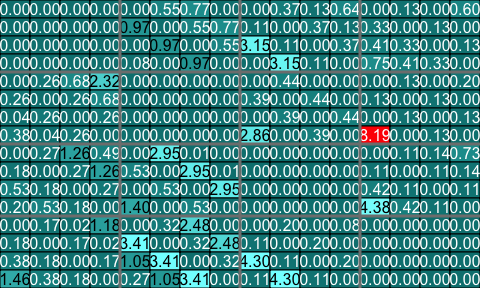
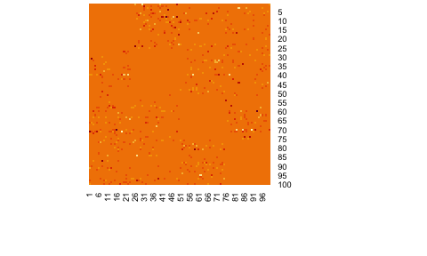
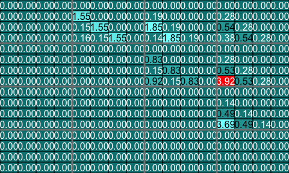
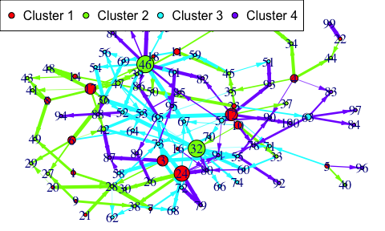

```{r setup, include = FALSE}
LOCAL <- identical(Sys.getenv("LOCAL"), "TRUE")
#LOCAL=FALSE
knitr::opts_chunk$set(purl = LOCAL)
knitr::opts_chunk$set(
  collapse = TRUE,
  comment = "#>",
  fig.width=5
)
```

# Patterns: a modeling tool dedicated to biological network modeling

It allows for **single** or **joint modeling** of, for instance, genes and proteins. It is design to work with **patterned data**. Famous examples of problems related to patterned data are:
* recovering **signals** in networks after a **stimulation** (cascade network reverse engineering),
* analysing **periodic signals**.


* It starts with the **selection of the actors** that will be the used in the reverse engineering upcoming step. An actor can be included in that selection based on its **differential effects** (for instance gene expression or protein abundance) or on its **time course profile**. 
* Wrappers for **actors clustering** functions and cluster analysis are provided. 
* It also allows **reverse engineering** of biological networks taking into account the observed time course patterns of the actors. Interactions between clusters of actors can be set by the user. Any number of clusters can be activated at a single time.
* Many **inference functions** are provided with the `Patterns` package and dedicated to get **specific features** for the inferred network such as **sparsity**, **robust links**, **high confidence links** or **stable through resampling links**. 
    + **lasso**, from the `lars` package
    + **lasso**, from the `glmnet` package. An unweighted and a weighted version of the algorithm are available
    + **spls**, from the `spls` package
    + **elasticnet**, from the `elasticnet` package
    + **stability selection**, from the `c060` package implementation of stability selection
    + **weighted stability selection**, a new weighted version of the `c060` package implementation of stability selection that I created for the package
    + **robust**, lasso from the `lars` package with light random Gaussian noise added to the explanatory variables
    + **selectboost**, from the `selectboost` package. The selectboost algorithm looks for the more stable links against resampling that takes into account the correlated structure of the predictors
    + **weighted selectboost**, a new weighted version of the `selectboost`.
* Some **simulation** and **prediction** tools are also available for cascade networks. 
* Examples of use with microarray or RNA-Seq data are provided.


The weights are viewed as a penalty factors in the penalized regression model: it is a number that multiplies the lambda value in the minimization problem to allow differential shrinkage, [Friedman et al. 2010](https://web.stanford.edu/~hastie/Papers/glmnet.pdf), equation 1 page 3. If equal to 0, it implies no shrinkage, and that variable is always included in the model. Default is 1 for all variables. Infinity means that the variable is excluded from the model. Note that the weights are rescaled to sum to the number of variables.


Due to maximum size requirement for CRAN packages, most of the graphics of the vignette will be created when the code is run.

<!--  -->


<!--  -->


<!--  -->


<!--  -->


<!--  -->


<!--  -->


<!--  -->


<!--  -->


A word for those that have been using our seminal work, the `Cascade` package that we created several years ago and that was a very efficient network reverse engineering tool for cascade networks 
(Jung, N., Bertrand, F., Bahram, S., Vallat, L., and Maumy-Bertrand, M. (2014), <https://doi.org/10.1093/bioinformatics/btt705>, <https://cran.r-project.org/package=Cascade>, <https://github.com/fbertran/Cascade> and <https://fbertran.github.io/Cascade/>).


The `Patterns` package is more than (at least) a threeway major extension of the `Cascade` package :

* **any number of groups** can be used whereas in the `Cascade` package only 1 group for each timepoint could be created, which prevented the users to create homogeneous clusters of genes in datasets that featured more than a few dozens of genes.
* **custom** $F$ matrices shapes whereas in the `Cascade` package only 1 shape was provided:
    + interaction between groups
    + custom design of inner cells of the $F$ matrix
* the custom $F$ matrices allow to deal with **heteregeneous networks** with several kinds of actors such as mixing genes and proteins in a single network to perform **joint inference**.
* about **nine inference algorithms** are provided, whereas 1 (lasso) in `Cascade`.

Hence the `Patterns` package should be viewed more as a completely new modelling tools than as an extension of the `Cascade` package.


This website and these examples were created by F. Bertrand and M. Maumy-Bertrand.

## Installation

You can install the released version of Patterns from [CRAN](https://CRAN.R-project.org) with:

```{r, eval = FALSE}
install.packages("Patterns")
```

You can install the development version of Patterns from [github](https://github.com) with:

```{r, eval = FALSE}
devtools::install_github("fbertran/Patterns")
```

## Examples

### Data management
Import Cascade Data (repeated measurements on several subjects) from the CascadeData package and turn them into a micro array object. The second line makes sure the CascadeData package is installed.
```{r microarrayclass, message=FALSE, warning=FALSE, eval = LOCAL}
library(Patterns)
if(!require(CascadeData)){install.packages("CascadeData")}
data(micro_US)
micro_US<-as.micro_array(micro_US[1:100,],time=c(60,90,210,390),subject=6)
str(micro_US)
```

Get a summay and plots of the data:
```{r plotmicroarrayclass, fig.keep='all', eval = LOCAL}
summary(micro_US)
plot(micro_US)
```

### Gene selection
There are several functions to carry out gene selection before the inference. They are detailed in the vignette of the package. 

### Data simulation
Let's simulate some cascade data and then do some reverse engineering.

We first design the F matrix for $T_i=4$ times and $Ngrp=4$ groups. The `Fmat`object is an array of sizes $(T_i,T-i,Ngrp^2)=(4,4,16)$.
```{r createF, eval = LOCAL}
Ti<-4
Ngrp<-4

Fmat=array(0,dim=c(Ti,Ti,Ngrp^2))

for(i in 1:(Ti^2)){
  if(((i-1) %% Ti) > (i-1) %/% Ti){
    Fmat[,,i][outer(1:Ti,1:Ti,function(x,y){0<(x-y) & (x-y)<2})]<-1
    }
}
```

The `Patterns` function `CascadeFinit` is an utility function to easily define such an F matrix.
```{r CascadeInit, eval = LOCAL}
Fbis=Patterns::CascadeFinit(Ti,Ngrp,low.trig=FALSE)
str(Fbis)
```

Check if the two matrices `Fmat` and `Fbis` are identical.
```{r CascadeInitCheck, eval = LOCAL}
print(all(Fmat==Fbis))
```

End of F matrix definition.
```{r CascadeFinalize, eval = LOCAL}
Fmat[,,3]<-Fmat[,,3]*0.2
Fmat[3,1,3]<-1
Fmat[4,2,3]<-1
Fmat[,,4]<-Fmat[,,3]*0.3
Fmat[4,1,4]<-1
Fmat[,,8]<-Fmat[,,3]
```

We set the seed to make the results reproducible and draw a scale free random network.
```{r randomN, eval = LOCAL}
set.seed(1)
Net<-Patterns::network_random(
  nb=100,
  time_label=rep(1:4,each=25),
  exp=1,
  init=1,
  regul=round(rexp(100,1))+1,
  min_expr=0.1,
  max_expr=2,
  casc.level=0.4
)
Net@F<-Fmat
str(Net)
```

Plot the simulated network.
```{r plotnet1, eval = LOCAL}
Patterns::plot(Net, choice="network")
```

If a gene clustering is known, it can be used as a coloring scheme.
```{r plotnet2, eval = LOCAL}
plot(Net, choice="network", gr=rep(1:4,each=25))
```

Plot the F matrix, for low dimensional F matrices.
```{r plotF, eval = LOCAL}
plot(Net, choice="F")
```

Plot the F matrix using the `pixmap` package, for high dimensional F matrices.
```{r plotFpixmap, eval = LOCAL}
plot(Net, choice="Fpixmap")
```

We simulate gene expression according to the network that was previously drawn
```{r genesimul, message=FALSE, warning=FALSE, eval = LOCAL}
set.seed(1)
M <- Patterns::gene_expr_simulation(
  network=Net,
  time_label=rep(1:4,each=25),
  subject=5,
  peak_level=200,
  act_time_group=1:4)
str(M)
```

Get a summay and plots of the simulated data:
```{r summarysimuldata, cache=TRUE, fig.keep="none", eval = LOCAL}
summary(M)
```

```{r plotsimuldata, fig.keep='all', cache=TRUE, fig.keep="none", eval = LOCAL}
plot(M)
```

### Network inferrence
We infer the new network using subjectwise leave one out cross-validation (default setting): all measurements from the same subject are removed from the dataset). The inference is carried out with a general Fshape.
```{r netinfdefault, cache=TRUE, fig.keep="none", eval = LOCAL}
Net_inf_P <- Patterns::inference(M, cv.subjects=TRUE)
```

Plot of the inferred F matrix
```{r Fresults, eval = LOCAL}
plot(Net_inf_P, choice="F")
```

Heatmap of the inferred coefficients of the Omega matrix
```{r heatresults, eval = LOCAL}
stats::heatmap(Net_inf_P@network, Rowv = NA, Colv = NA, scale="none", revC=TRUE)
```


Default values fot the $F$ matrices. The `Finit` matrix (starting values for the algorithm). In our case, the `Finit`object is an array of sizes $(T_i,T-i,Ngrp^2)=(4,4,16)$.
```{r Finitshow, eval = LOCAL}
Ti<-4;
ngrp<-4
nF<-ngrp^2
Finit<-array(0,c(Ti,Ti,nF))	
              for(ii in 1:nF){    
                if((ii%%(ngrp+1))==1){
                  Finit[,,ii]<-0
                } else {
                  Finit[,,ii]<-cbind(rbind(rep(0,Ti-1),diag(1,Ti-1)),rep(0,Ti))+rbind(cbind(rep(0,Ti-1),diag(1,Ti-1)),rep(0,Ti))
                }
              }
```

The `Fshape` matrix (default shape for `F` matrix the algorithm). Any interaction between groups and times are permitted except the retro-actions (a group on itself, or an action at the same time for an actor on another one).
```{r Fshapeshow, eval = LOCAL}
Fshape<-array("0",c(Ti,Ti,nF)) 
for(ii in 1:nF){  
  if((ii%%(ngrp+1))==1){
    Fshape[,,ii]<-"0"
  } else {
    lchars <- paste("a",1:(2*Ti-1),sep="")
    tempFshape<-matrix("0",Ti,Ti)
    for(bb in (-Ti+1):(Ti-1)){
      tempFshape<-replaceUp(tempFshape,matrix(lchars[bb+Ti],Ti,Ti),-bb)
    }
    tempFshape <- replaceBand(tempFshape,matrix("0",Ti,Ti),0)
    Fshape[,,ii]<-tempFshape
  }
}
```

Any other form can be used. A "0" coefficient is missing from the model. It allows testing the best structure of an "F" matrix and even performing some significance tests of hypothses on the structure of the $F$ matrix.

The `IndicFshape` function allows to design custom F matrix for cascade networks with equally spaced measurements by specifying the zero and non zero $F_{ij}$ cells of the $F$ matrix. It is useful for models featuring several clusters of actors that are activated at the time. Let's define the following indicatrix matrix (action of all groups on each other, which is not a possible real modeling setting and is only used as an example):
```{r Fshapeothershow, eval = LOCAL}
TestIndic=matrix(!((1:(Ti^2))%%(ngrp+1)==1),byrow=TRUE,ngrp,ngrp)
TestIndic
```

For that choice, we get those init and shape $F$ matrices.
```{r Fshapeothershow2, eval = LOCAL}
IndicFinit(Ti,ngrp,TestIndic)
IndicFshape(Ti,ngrp,TestIndic)
```

Those $F$ matrices are lower diagonal ones to enforce that an observed value at a given time can only be predicted by a value that was observed in the past only (i.e. neither at the same moment or in the future). 

The `plotF` is convenient to display F matrices. Here are the the displays of the three $F$ matrices we have just introduced.

```{r plotfshape1, eval = LOCAL}
plotF(Fshape,choice="Fshape")
```

```{r plotfshape2, fig.keep="none", eval = LOCAL}
plotF(CascadeFshape(4,4),choice="Fshape")
```
```{r plotfshape3, fig.keep="none", eval = LOCAL}
plotF(IndicFshape(Ti,ngrp,TestIndic),choice="Fshape")
```

We now fit the model with an $F$ matrix that is designed for cascade networks.

Specific Fshape
```{r netinfLC, cache=TRUE, fig.keep="none", eval = LOCAL}
Net_inf_P_S <- Patterns::inference(M, Finit=CascadeFinit(4,4), Fshape=CascadeFshape(4,4))
```

Plot of the inferred F matrix
```{r FresultsLC, eval = LOCAL}
plot(Net_inf_P_S, choice="F")
```

Heatmap of the coefficients of the Omega matrix of the network. They reflect the use of a special $F$ matrix. It is an example of an F matrix specifically designed to deal with cascade networks.
```{r heatresultsLC, fig.keep="none", eval = LOCAL}
stats::heatmap(Net_inf_P_S@network, Rowv = NA, Colv = NA, scale="none", revC=TRUE)
```


There are many fitting functions provided with the `Patterns` package in order to search for **specific features** for the inferred network such as **sparsity**, **robust links**, **high confidence links** or **stable through resampling links**. :

* **LASSO**, from the `lars` package
* **LASSO2**, from the `glmnet` package. An unweighted and a weighted version of the algorithm are available
* **SPLS**, from the `spls` package
* **ELASTICNET**, from the `elasticnet` package
* **stability.c060**, from the `c060` package implementation of stability selection
* **stability.c060.weighted**, a new weighted version of the `c060` package implementation of stability selection
* **robust**, lasso from the `lars` package with light random Gaussian noise added to the explanatory variables
* **selectboost.weighted**, a new weighted version of the `selectboost` package implementation of the selectboost algorithm to look for the more stable links against resampling that takes into account the correlated structure of the predictors. If no weights are provided, equal weigths are for all the variables (=non weighted case).

```{r netinflasso2, cache=TRUE, fig.keep="none", eval = LOCAL}
Net_inf_P_Lasso2 <- Patterns::inference(M, Finit=CascadeFinit(4,4), Fshape=CascadeFshape(4,4), fitfun="LASSO2")
```

Plot of the inferred F matrix
```{r Fresultslasso2, fig.keep="none", eval = LOCAL}
plot(Net_inf_P_Lasso2, choice="F")
```

Heatmap of the coefficients of the Omega matrix of the network
```{r heatresultslasso2, fig.keep="none", eval = LOCAL}
stats::heatmap(Net_inf_P_Lasso2@network, Rowv = NA, Colv = NA, scale="none", revC=TRUE)
```

We create a weighting vector to perform weighted lasso inference.
```{r netinfPriors, eval = LOCAL}
Weights_Net=slot(Net,"network")
Weights_Net[Net@network!=0]=.1        
Weights_Net[Net@network==0]=1000
```

```{r netinflasso2Weighted, cache=TRUE, fig.keep="none", eval = LOCAL}
Net_inf_P_Lasso2_Weighted <- Patterns::inference(M, Finit=CascadeFinit(4,4), Fshape=CascadeFshape(4,4), fitfun="LASSO2", priors=Weights_Net)
```

Plot of the inferred F matrix
```{r Fresultslasso2Weighted, fig.keep="none", eval = LOCAL}
plot(Net_inf_P_Lasso2_Weighted, choice="F")
```

Heatmap of the coefficients of the Omega matrix of the network
```{r heatresultslasso2Weighted, fig.keep="none", eval = LOCAL}
stats::heatmap(Net_inf_P_Lasso2_Weighted@network, Rowv = NA, Colv = NA, scale="none", revC=TRUE)
```


```{r netinfSPLS, cache=TRUE, fig.keep="none", eval = LOCAL}
Net_inf_P_SPLS <- Patterns::inference(M, Finit=CascadeFinit(4,4), Fshape=CascadeFshape(4,4), fitfun="SPLS")
```

Plot of the inferred F matrix
```{r FresultsSPLS, fig.keep="none", eval = LOCAL}
plot(Net_inf_P_SPLS, choice="F")
```

Heatmap of the coefficients of the Omega matrix of the network
```{r heatresultsSPLS, fig.keep="none", eval = LOCAL}
stats::heatmap(Net_inf_P_SPLS@network, Rowv = NA, Colv = NA, scale="none", revC=TRUE)
```

```{r netinfEN, cache=TRUE, fig.keep="none", eval = LOCAL}
Net_inf_P_ELASTICNET <- Patterns::inference(M, Finit=CascadeFinit(4,4), Fshape=CascadeFshape(4,4), fitfun="ELASTICNET")
```

Plot of the inferred F matrix
```{r FresultsEN, fig.keep="none", eval = LOCAL}
plot(Net_inf_P_ELASTICNET, choice="F")
```

Heatmap of the coefficients of the Omega matrix of the network
```{r heatresultsEN, fig.keep="none", eval = LOCAL}
stats::heatmap(Net_inf_P_ELASTICNET@network, Rowv = NA, Colv = NA, scale="none", revC=TRUE)
```

```{r netinfStab, cache=TRUE, fig.keep="none", eval = LOCAL}
Net_inf_P_stability <- Patterns::inference(M, Finit=CascadeFinit(4,4), Fshape=CascadeFshape(4,4), fitfun="stability.c060")
```

Plot of the inferred F matrix
```{r FresultsStab, fig.keep="none", eval = LOCAL}
plot(Net_inf_P_stability, choice="F")
```

Heatmap of the coefficients of the Omega matrix of the network
```{r heatresultsStab, fig.keep="none", eval = LOCAL}
stats::heatmap(Net_inf_P_stability@network, Rowv = NA, Colv = NA, scale="none", revC=TRUE)
```

```{r netinfStabWeight, cache=TRUE, fig.keep="none", eval = LOCAL}
Net_inf_P_StabWeight <- Patterns::inference(M, Finit=CascadeFinit(4,4), Fshape=CascadeFshape(4,4), fitfun="stability.c060.weighted", priors=Weights_Net)
```

Plot of the inferred F matrix
```{r FresultsStabWeight, fig.keep="none", eval = LOCAL}
plot(Net_inf_P_StabWeight, choice="F")
```

Heatmap of the coefficients of the Omega matrix of the network
```{r heatresultsStabWeight, fig.keep="none", eval = LOCAL}
stats::heatmap(Net_inf_P_StabWeight@network, Rowv = NA, Colv = NA, scale="none", revC=TRUE)
```

```{r netinfRobust, cache=TRUE, fig.keep="none", eval = LOCAL}
Net_inf_P_Robust <- Patterns::inference(M, Finit=CascadeFinit(4,4), Fshape=CascadeFshape(4,4), fitfun="robust")
```

Plot of the inferred F matrix
```{r FresultsRobust, fig.keep="none", eval = LOCAL}
plot(Net_inf_P_Robust, choice="F")
```

Heatmap of the coefficients of the Omega matrix of the network
```{r heatresultsRobust, fig.keep="none", eval = LOCAL}
stats::heatmap(Net_inf_P_Robust@network, Rowv = NA, Colv = NA, scale="none", revC=TRUE)
```

```{r netinfSB, cache=TRUE, fig.keep="none", eval = LOCAL}
Weights_Net_1 <- Weights_Net
Weights_Net_1[,] <- 1
Net_inf_P_SelectBoost <- Patterns::inference(M, Finit=CascadeFinit(4,4), Fshape=CascadeFshape(4,4), fitfun="selectboost.weighted",priors=Weights_Net_1)
```

```{r FresultsSBpre, fig.keep="none", eval = LOCAL}
detach("package:Patterns", unload=TRUE)
library(Patterns)
```

Plot of the inferred F matrix
```{r FresultsSB, fig.keep="none", eval = LOCAL}
plot(Net_inf_P_SelectBoost, choice="F")
```

Heatmap of the coefficients of the Omega matrix of the network
```{r heatresultsSB, fig.keep="none", eval = LOCAL}
stats::heatmap(Net_inf_P_SelectBoost@network, Rowv = NA, Colv = NA, scale="none", revC=TRUE)
```

```{r netinfSBW, cache=TRUE, fig.keep="none", eval = LOCAL}
Net_inf_P_SelectBoostWeighted <- Patterns::inference(M, Finit=CascadeFinit(4,4), Fshape=CascadeFshape(4,4), fitfun="selectboost.weighted",priors=Weights_Net)
```

```{r FresultsSBWpre, fig.keep="none", eval = LOCAL}
detach("package:Patterns", unload=TRUE)
library(Patterns)
```

Plot of the inferred F matrix
```{r FresultsSBW, fig.keep="none", eval = LOCAL}
plot(Net_inf_P_SelectBoostWeighted, choice="F")
```

Heatmap of the coefficients of the Omega matrix of the network
```{r heatresultsSBW, fig.keep="none", eval = LOCAL}
stats::heatmap(Net_inf_P_SelectBoostWeighted@network, Rowv = NA, Colv = NA, scale="none", revC=TRUE)
```

###Post inference network analysis
Such an analysis is only required if the model was not fitted using the stability selection or the selectboost algorithm.

Create an animation of the network with increasing cutoffs with an animated .gif format or a  html webpage. See the the [webpage of the `Patterns` package](https://github.com/fbertran/Patterns) for the animation results at the .gif and .html formats.
```{r evolution, warning=FALSE, eval=FALSE}
data(network)
sequence<-seq(0,0.2,length.out=20)
evolution(network,sequence,type.ani = "gif")
evolution(network,sequence,type.ani = "html")
```

Evolution of some properties of a reverse-engineered network with increasing cut-off values.
```{r compare, warning=FALSE, eval = LOCAL}
data(Net)
data(Net_inf_PL)

#Comparing true and inferred networks
Crit_values=NULL

#Here are the cutoff level tested
test.seq<-seq(0,max(abs(Net_inf_PL@network*0.9)),length.out=200)
for(u in test.seq){
	Crit_values<-rbind(Crit_values,Patterns::compare(Net,Net_inf_PL,u))
}
matplot(test.seq,Crit_values,type="l",ylab="Criterion value",xlab="Cutoff level",lwd=2)
legend(x="topleft", legend=colnames(Crit_values), lty=1:5,col=1:5,ncol=2,cex=.9)
```

We switch to data that were derived from the inferrence of a real biological network and try to detect the optimal cutoff value: the best cutoff value for a network to fit a scale free network. The `cutoff` was validated only single group cascade networks (number of actors groups = number of timepoints) and for genes dataset. Instead of the `cutoff` function, manual curation or the stability selection or the selectboost algorithm should be used.

```{r cutoff, cache=TRUE, fig.keep="none", eval = LOCAL}
data("networkCascade")
set.seed(1)
cutoff(networkCascade)
```

Analyze the network with a cutoff set to the previouly found 0.133 optimal value.
```{r analyzenet, warning=FALSE, cache=TRUE, eval = LOCAL}
analyze_network(networkCascade,nv=0.133)
```

```{r plotnet, warning=FALSE, eval = LOCAL}
data(Selection)
plot(networkCascade,nv=0.133, gr=Selection@group)
```


### Perform gene selection

Import data.
```{r microselection, warning=FALSE, cache=FALSE, eval = LOCAL}
library(Patterns)
library(CascadeData)
data(micro_S)
micro_S<-as.micro_array(micro_S,time=c(60,90,210,390),subject=6,gene_ID=rownames(micro_S))
data(micro_US)
micro_US<-as.micro_array(micro_US,time=c(60,90,210,390),subject=6,gene_ID=rownames(micro_US))
```

Select early genes (t1 or t2):
```{r microselection1, warning=FALSE, cache=TRUE, eval = LOCAL}
Selection1<-Patterns::geneSelection(x=micro_S,y=micro_US,20,wanted.patterns=rbind(c(0,1,0,0),c(1,0,0,0),c(1,1,0,0)))
```

Section genes with first significant differential  expression at t1:
```{r microselection2, warning=FALSE, cache=TRUE, eval = LOCAL}
Selection2<-geneSelection(x=micro_S,y=micro_US,20,peak=1)
```

Section genes with first significant differential expression at t2:
```{r microselection3, warning=FALSE, cache=TRUE, eval = LOCAL}
Selection3<-geneSelection(x=micro_S,y=micro_US,20,peak=2)
```

Select later genes (t3 or t4)
```{r microselection4, warning=FALSE, cache=TRUE, eval = LOCAL}
Selection4<-geneSelection(x=micro_S,y=micro_US,50,
wanted.patterns=rbind(c(0,0,1,0),c(0,0,0,1),c(1,1,0,0)))
```

Merge those selections:
```{r microselection5, warning=FALSE, eval = LOCAL}
Selection<-unionMicro(Selection1,Selection2)
Selection<-unionMicro(Selection,Selection3)
Selection<-unionMicro(Selection,Selection4)
head(Selection)
```

Summarize the final selection:
```{r microselection6, warning=FALSE, fig.keep="none", eval = LOCAL}
summary(Selection)
```

Plot the final selection:
```{r microselection7, warning=FALSE, fig.keep="none", eval = LOCAL}
plot(Selection)
```

This process could be improved by retrieve a real gene_ID using the `bitr` function of the `ClusterProfiler` package or by performing independent filtering using `jetset` package to only keep at most only probeset (the best one, if there is one good enough) per gene_ID.


